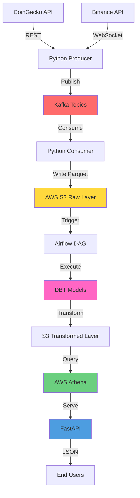

# 🚀 Real-Time Crypto Analytics Pipeline

[](https://www.python.org/downloads/)
[](LICENSE)
[](https://aws.amazon.com/)

End-to-end data engineering project demonstrating real-time cryptocurrency analytics using modern data stack: **Kafka**, **Airflow**, **DBT**, **AWS S3/Athena**, and **FastAPI**.

---

## 📋 Table of Contents

- [Architecture](#architecture)
- [Features](#features)
- [Tech Stack](#tech-stack)
- [Project Structure](#project-structure)
- [Prerequisites](#prerequisites)
- [Installation](#installation)
- [Usage](#usage)
- [API Endpoints](#api-endpoints)
- [Cost Estimation](#cost-estimation)
- [Development](#development)

---

## 🏗️ Architecture



### Data Flow

1. **Ingestion Layer**: Python producers fetch crypto data from CoinGecko and Binance APIs every 10 seconds
2. **Streaming Layer**: Data is published to Kafka topics (`crypto-prices`, `crypto-trades`)
3. **Landing Layer**: Kafka consumers write raw data to S3 in Parquet format (partitioned by date/hour)
4. **Orchestration**: Airflow DAG runs hourly to trigger DBT transformations
5. **Transformation Layer**: DBT models create aggregations, calculate volatility, and generate metrics
6. **Analytics Layer**: AWS Athena queries transformed data for ad-hoc analysis
7. **API Layer**: FastAPI serves processed data via REST endpoints

---

## ✨ Features

- ✅ **Real-time streaming** of cryptocurrency prices and trades
- ✅ **Automated ETL pipeline** with Airflow orchestration
- ✅ **Data transformations** using DBT (aggregations, metrics, KPIs)
- ✅ **Cloud-native storage** with AWS S3 (Parquet format)
- ✅ **SQL analytics** via AWS Athena
- ✅ **RESTful API** for data access
- ✅ **Dockerized services** for easy deployment
- ✅ **Cost-optimized** architecture (~$2-5/month)
- ✅ **Production-ready** with logging, error handling, and monitoring

---

## 🛠️ Tech Stack

| Category | Technologies |
|----------|-------------|
| **Language** | Python 3.10+ |
| **Streaming** | Apache Kafka, Confluent Kafka |
| **Orchestration** | Apache Airflow |
| **Transformation** | DBT (Data Build Tool) |
| **Cloud** | AWS S3, AWS Athena |
| **API** | FastAPI, Uvicorn |
| **Data Processing** | Pandas, PyArrow |
| **Containerization** | Docker, Docker Compose |
| **Testing** | Pytest |
| **Code Quality** | Black, Flake8, Mypy |

---

## 📁 Project Structure

```
crypto-analytics-pipeline/
├── src/
│   ├── producers/              # Kafka producers for data ingestion
│   │   ├── coingecko_producer.py
│   │   └── binance_producer.py
│   ├── consumers/              # Kafka consumers for S3 landing
│   │   └── s3_consumer.py
│   ├── api/                    # FastAPI application
│   │   ├── main.py
│   │   ├── routes/
│   │   └── models/
│   └── utils/                  # Shared utilities
│       ├── config.py
│       ├── logger.py
│       └── aws_client.py
├── airflow/
│   ├── dags/                   # Airflow DAGs
│   │   └── crypto_etl_dag.py
│   ├── logs/
│   └── plugins/
├── dbt/
│   ├── models/                 # DBT transformation models
│   │   ├── staging/
│   │   ├── intermediate/
│   │   └── marts/
│   ├── dbt_project.yml
│   └── profiles.yml
├── tests/                      # Unit and integration tests
│   ├── test_producers.py
│   ├── test_consumers.py
│   └── test_api.py
├── docker-compose.yml          # Local development setup
├── requirements.txt            # Python dependencies
├── .env.example                # Environment variables template
├── Makefile                    # Common commands
└── README.md
```

---

## 📋 Prerequisites

- **Python** 3.10+
- **Docker** & Docker Compose
- **AWS Account** with:
  - S3 bucket created
  - IAM user with S3 and Athena permissions
  - AWS CLI configured (`aws configure`)
- **API Keys**:
  - CoinGecko API (free tier)
  - Binance API (optional, for WebSocket trades)

---

## 🚀 Installation

### 1. Clone the Repository

```bash
git clone https://github.com/yourusername/crypto-analytics-pipeline.git
cd crypto-analytics-pipeline
```

### 2. Set Up Environment Variables

```bash
cp .env.example .env
# Edit .env with your AWS credentials and API keys
```

**Required variables:**
```env
# AWS
AWS_ACCESS_KEY_ID=your_access_key
AWS_SECRET_ACCESS_KEY=your_secret_key
AWS_REGION=us-east-1
S3_BUCKET_NAME=crypto-analytics-raw

# Kafka
KAFKA_BOOTSTRAP_SERVERS=localhost:9092

# APIs
COINGECKO_API_KEY=your_api_key  # Optional for free tier
```

### 3. Install Python Dependencies

```bash
python -m venv venv
source venv/bin/activate  # On Windows: venv\Scripts\activate
pip install -r requirements.txt
```

### 4. Start Docker Services

```bash
docker-compose up -d
```

This will start:
- Kafka + Zookeeper
- PostgreSQL (for Airflow metadata)
- Airflow Webserver (http://localhost:8080)
- Airflow Scheduler

**Airflow credentials:** `admin` / `admin`

### 5. Create S3 Bucket

```bash
aws s3 mb s3://crypto-analytics-raw
aws s3 mb s3://crypto-analytics-transformed
```

---

## 🎯 Usage

### Step 1: Start Kafka Producers

```bash
# Terminal 1: CoinGecko price data
python src/producers/coingecko_producer.py

# Terminal 2: Binance trade data (optional)
python src/producers/binance_producer.py
```

### Step 2: Start Kafka Consumer

```bash
# Terminal 3: Consume and write to S3
python src/consumers/s3_consumer.py
```

### Step 3: Trigger Airflow DAG

1. Open Airflow UI: http://localhost:8080
2. Enable the `crypto_etl_dag` DAG
3. Trigger manually or wait for scheduled run (hourly)

### Step 4: Query Data with Athena

```sql
-- Example: Get hourly average prices
SELECT 
    symbol,
    hour,
    AVG(price) as avg_price,
    MAX(price) as max_price,
    MIN(price) as min_price
FROM crypto_analytics_transformed.hourly_prices
WHERE date = CURRENT_DATE
GROUP BY symbol, hour
ORDER BY hour DESC;
```

### Step 5: Start FastAPI

```bash
uvicorn src.api.main:app --reload --port 8000
```

Access API docs: http://localhost:8000/docs

---

## 📡 API Endpoints

| Method | Endpoint | Description |
|--------|----------|-------------|
| GET | `/api/v1/prices/{symbol}` | Get latest price for a crypto symbol |
| GET | `/api/v1/prices/history/{symbol}` | Get price history (24h) |
| GET | `/api/v1/metrics/volatility/{symbol}` | Calculate volatility metrics |
| GET | `/api/v1/metrics/volume/{symbol}` | Get trading volume stats |
| GET | `/health` | Health check endpoint |

**Example:**
```bash
curl http://localhost:8000/api/v1/prices/bitcoin
```

---

## 💰 Cost Estimation (AWS)

| Service | Usage | Monthly Cost |
|---------|-------|--------------|
| **S3 Storage** | ~5 GB (30 days of data) | ~$0.12 |
| **S3 Requests** | ~100K PUT, 50K GET | ~$0.50 |
| **Athena** | ~100 queries (10 GB scanned) | ~$0.50 |
| **Data Transfer** | ~1 GB OUT | $0.09 |
| **Total** | | **~$1.21/month** |

✅ **Within AWS Free Tier for first 12 months!**

---

## 🧪 Development

### Running Tests

```bash
# Run all tests
pytest

# With coverage
pytest --cov=src tests/

# Specific test file
pytest tests/test_producers.py -v
```

### Code Quality

```bash
# Format code
black src/ tests/

# Lint
flake8 src/ tests/

# Type checking
mypy src/
```

### DBT Commands

```bash
cd dbt/

# Install dependencies
dbt deps

# Run models
dbt run

# Run tests
dbt test

# Generate docs
dbt docs generate
dbt docs serve
```

---

## 🤝 Contributing

Contributions are welcome! Please:
1. Fork the repository
2. Create a feature branch
3. Commit your changes
4. Push to the branch
5. Open a Pull Request

---

## 📄 License

This project is licensed under the MIT License - see the [LICENSE](LICENSE) file for details.

---

## 👤 Author

**Yevhen Mykytsei**
- GitHub: [@skeletronys](https://github.com/skeletronys)
- LinkedIn: [yevhen-mykytsei](https://linkedin.com/in/yevhen-mykytsei-160998304)
- Email: yevhenmykytsei@gmail.com

---

## 🙏 Acknowledgments

- CoinGecko for free cryptocurrency API
- Apache Software Foundation for Kafka and Airflow
- dbt Labs for the amazing transformation tool
- AWS for cloud infrastructure

---

**⭐ If you find this project helpful, please give it a star!**